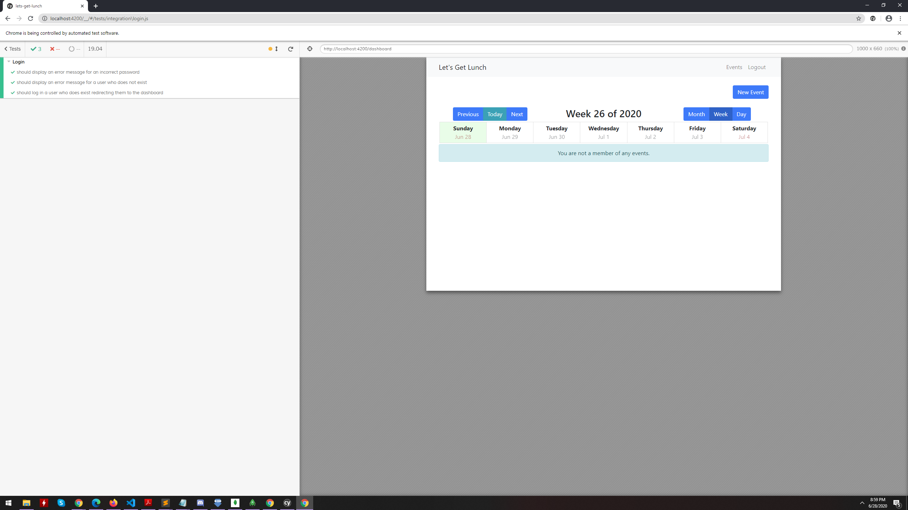

# LetsGetLunch

This project was generated with [Angular CLI](https://github.com/angular/angular-cli) version 8.1.2. Demo <strong>[here](https://lets-get-lunch-fe-wt854.herokuapp.com/)</strong>.

## About
This project is an event and restaurant recommendation web app. A user can create events, which will display recommended restaurant applications based on his/her dietary preferences. Other users can subscribe to the event(s) as well as make comments. Screenshots of the application are at the end of the readme. 

## Credits
Credits to [Adam Morgan](https://github.com/atom-morgan) for his [Angular tutorial](https://github.com/theangulartutorial). 

## Development server

Run `ng serve` for the frontend dev server. Navigate to `http://localhost:4200/`. The app will automatically reload if you change any of the source files.

## Build

Run `ng build` to build the project. The build artifacts will be stored in the `dist/` directory. Use the `--prod` flag for a production build.

## Running unit tests

Run `ng test` to execute the unit tests via [Karma](https://karma-runner.github.io).

## Running end-to-end tests

Run `./node_modules/.bin/cypress open` to execute the end-to-end tests via [Cypress](https://www.cypress.io/).

## Main Page

## Signup Account Page

## Dashboard

## Create Event
#### Autocomplete location using Google Map's Maps Javascript API and Places API. 

#### Calendar

#### Successfully created event

#### Event on dashboard

## List of Events

## Event Details

#### Comment on event details

#### Different user comment on event details
Other users can find events from the event list, and view the event details. They can not only comment on those events but also subscribe to them as well. 

Subscribing to an event will list it in the user's calendar. 

